Welcome to this project which is a text based choose your own adventure game.
Inspired by the Monkey Island Series of point and click adventure games developed by Lucasfilm Games.
Specifically this game puts you into an adventure directly inspired by events from the first entry 'The Secret of Monkey Island'.
The player takes on the role of Guybrush Threepwood a young man who dreams of becoming a great pirate.
During the adventure the player finds themselves on a ship sailing to Monkey Island and must solve puzzles to progress
This project aims to mimic these events instructing the player to find the correct items to win the game.
The items chosen are similar to those found within the original adventure as seen below in an image taken from the game.

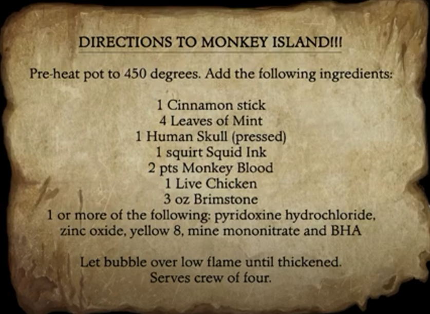

## User Experience

### User Stories
#### As the site creator:
* Create a simple webpage to allow users to interact with the app
* Create an interesting puzzle game application providing themed entertainment value.
#### As a User:
* Immediately be informed of the main purpose of the game and how to play.
* Follow the clues provided within the text to explore and find required items

## User Experience
* The logic was mapped out and planed using a flowchart generated using [LucidChart](https://www.lucidchart.com/pages/landing?utm_source=google&utm_medium=cpc&utm_campaign=_chart_en_tier1_mixed_search_brand_exact_&km_CPC_CampaignId=1490375427&km_CPC_AdGroupID=55688909257&km_CPC_Keyword=lucid%20chart&km_CPC_MatchType=e&km_CPC_ExtensionID=&km_CPC_Network=g&km_CPC_AdPosition=&km_CPC_Creative=442433236001&km_CPC_TargetID=kwd-55720648523&km_CPC_Country=9045109&km_CPC_Device=c&km_CPC_placement=&km_CPC_target=&gad_source=1&gclid=Cj0KCQiAyKurBhD5ARIsALamXaGxEw9vnqVqPJdU5YFdRCgB6b4gaOdBagCYFDN8pL4s91RNoE7t0LoaAlYcEALw_wcB) 
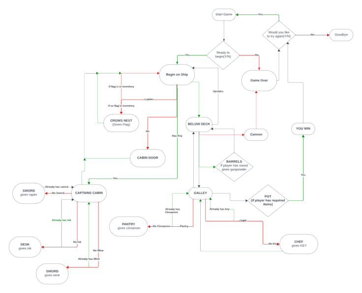

## Design

### Colour
* Using the Colorama library in Python, colour was able to be added to the program to display in various colours depending on scenario
* Red usually provides a negative response such as a game over, blue is something special such as end game or inventory
* green usually means a success of some kind whether it be during hangman or finding all items and brewing the potion

### Features
* The game starts with a title screen setting the scene for the player and giving the option to begin
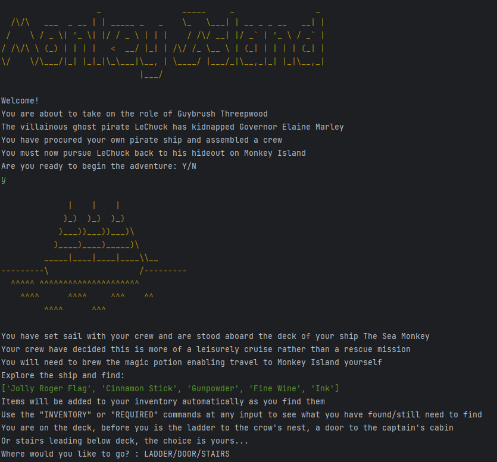
* If the player chooses not to begin game they will be taken to the game over screen at which point they may restart the game or quit to be taken to the goodbye screen
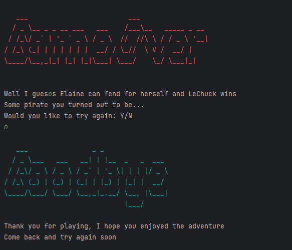
* The players must then explore the ship and find the neccesary items
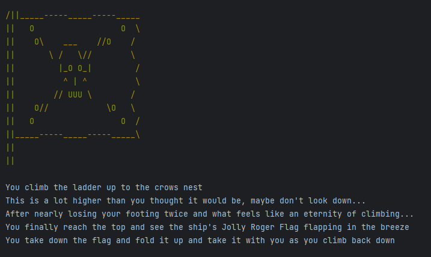
* the player is also able to check their inventory at any time to see what is left to find
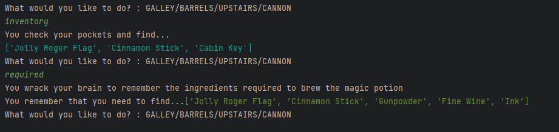
* At certain points the player requires specific items to proceed
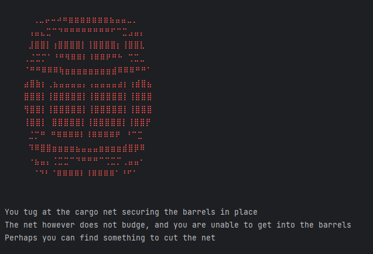
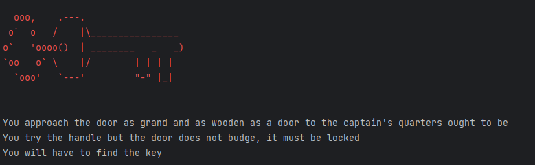
* The player will also be prompted to play a minigame of hangman to obtain one of the items
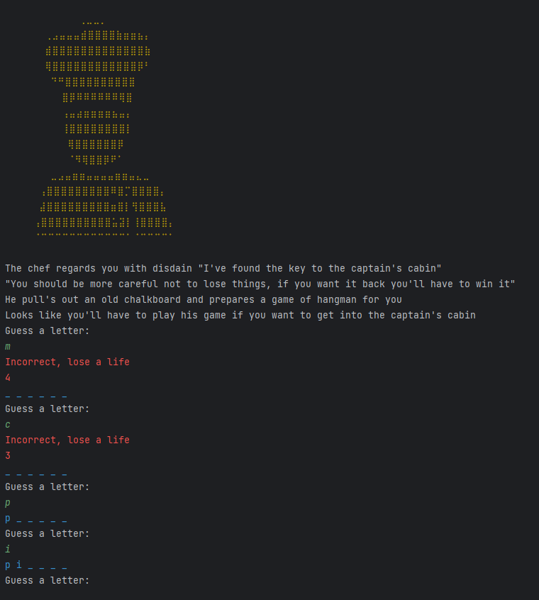
* There is also choices to trigger a game over and a final ending screen when all items have been found
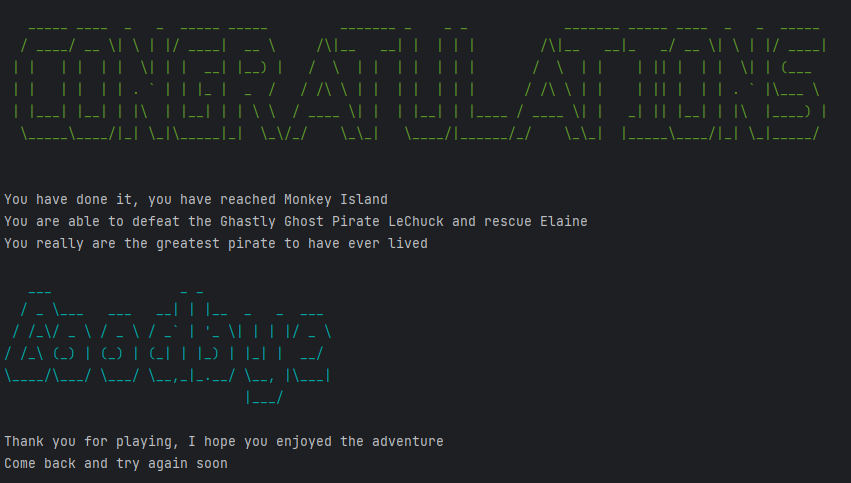
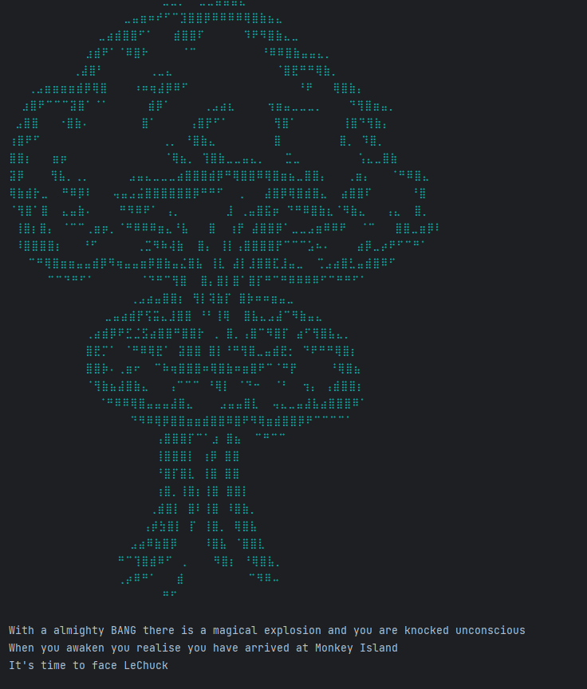

### Future Features
* in future releases it would be good to expand the game further and include more complex puzzle aspects
* add more environments and other tasks to complete

## Technologies Used

### Python Packages/Libraries
* [Time](https://pypi.org/project/time/) - used for typewriter effect
* [Colorama](https://pypi.org/project/colorama/) - added color effect
* [Random](https://docs.python.org/3/library/random.html) - generates random integer within hangman game

### Testing
* The code was tested extensively in the terminal during production to ensure each method worked correctly
* incorrect inputs were used to test the validation methods
* The code was passed through a PEP 8 Validator and while there were almost no issues

### Credits/Resources
* [Stack Overflow](https://stackoverflow.com/questions/20302331/typing-effect-in-python) helped with the code for the typewriter effect
* [One](https://www.asciiart.eu/), [two](https://asciiart.cc/), [three](https://emojicombos.com/) sites were used for resourcing Ascii art
* [Patorjk](https://patorjk.com/software/taag/#p=display&f=Graffiti&t=Type%20Something%20) was used to generate the Ascii Word Art
* [PEP8](https://pep8ci.herokuapp.com/#) - PEP8 Validator
##
## Reminders

* Your code must be placed in the `run.py` file
* Your dependencies must be placed in the `requirements.txt` file
* Do not edit any of the other files or your code may not deploy properly

## Creating the Heroku app

When you create the app, you will need to add two buildpacks from the _Settings_ tab. The ordering is as follows:

1. `heroku/python`
2. `heroku/nodejs`

You must then create a _Config Var_ called `PORT`. Set this to `8000`

If you have credentials, such as in the Love Sandwiches project, you must create another _Config Var_ called `CREDS` and paste the JSON into the value field.

Connect your GitHub repository and deploy as normal.

## Constraints

The deployment terminal is set to 80 columns by 24 rows. That means that each line of text needs to be 80 characters or less otherwise it will be wrapped onto a second line.

-----
Happy coding!
